# Agentic Soccer Match Prediction over MCP

**[Live Demo](https://agentic-soccer-match-prediction-mcp.vercel.app)**

Calibrated match predictions at five layers -- outcome, exact score, event sequence, player props, market value -- served through a LangGraph agent over three MCP servers, with conformal uncertainty guarantees, human-in-the-loop staking approval, and a full RL training pipeline that transfers to real markets.


---

## The Product


Liga MX, MLS, top-5 European leagues, international tournaments -- live standings, in-league Elo, matchup projections, and a bracket builder. Click any league to drill in; click any match for the full prediction breakdown.


The agent console surfaces every prediction with conformal uncertainty bands, the evidence trail, and HITL approval before any staking suggestion reaches the user.


<details>
<summary>Mobile views</summary>


</details>

---

## Architecture

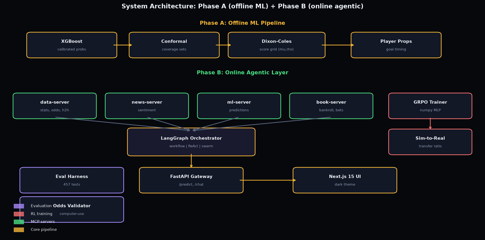

**Phase A** -- Offline ML pipeline: leakage-guarded features, XGBoost + isotonic calibration + split-conformal sets, Dixon-Coles score grid, goal-timing model, player-prop allocation, edge/EV suggestions. One versioned artifact bundle.

**Phase B** -- Online agentic layer: FastAPI gateway, LangGraph orchestrator (MCP client), 5 MCP servers (Sports Data, News/Sentiment, ML Inference, Code Sandbox, Betting Book). Three execution modes: deterministic Workflow, parallel Swarm with adversarial Critic, and ReAct for follow-ups.

---

## Real-World Results

### EPL Backtest -- 1,520 matches, walk-forward

| Forecaster | Log Loss | Brier | RPS |
|---|---|---|---|
| **Closing line (Pinnacle)** | **0.9448** | **0.5597** | **0.1922** |
| Model | 1.0383 | 0.5874 | 0.2035 |
| Naive baseline | 1.0652 | 0.6446 | 0.2337 |

The closing line wins -- reported honestly. The model beats the naive baseline on every metric in every fold. Conformal coverage: 0.888 vs 0.90 target.

### World Cup 2026 -- 102 live tournament matches

| Forecaster | Log Loss | Brier | Accuracy |
|---|---|---|---|
| **Model** | **0.9013** | **0.5331** | **62.7%** |
| Frequency prior | 1.0552 | 0.6367 | 47.1% |

Knockout accuracy: 70%. Conformal coverage: 0.951 vs 0.90 target.

Full reports: [EPL backtest](docs/backtest_epl.md) | [WC26 report](docs/wc26_report.md) | [Conformal study](docs/conformal_study.md)

---

## RL Training Pipeline

### GRPO Policy Optimization

Group Relative Policy Optimization (Shao et al., 2024) applied to staking. A 2,788-parameter MLP implemented from scratch in numpy (no PyTorch) maps per-fixture features to {skip, bet_H, bet_D, bet_A}. GRPO replaces the value network with a group-relative baseline.

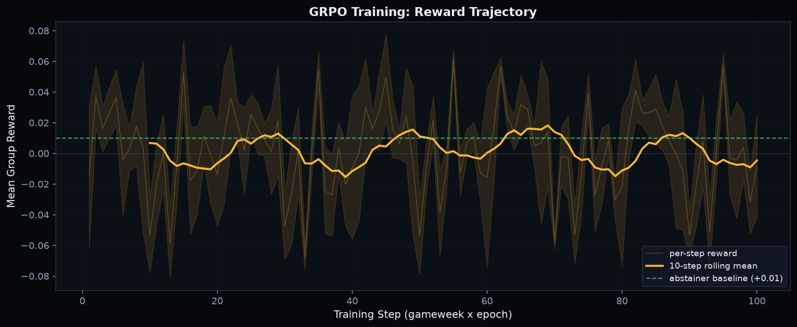

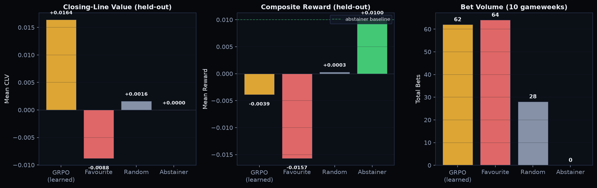

| Policy | Mean CLV | Total Bets | Mean Reward |
|--------|----------|------------|-------------|
| **GRPO (learned)** | **+0.016** | **62** | -0.004 |
| Favourite | -0.009 | 64 | -0.016 |
| Random | +0.002 | 28 | +0.000 |
| Abstainer | 0.000 | 0 | +0.010 |

The GRPO policy achieves the highest CLV of any policy that places bets, outperforming the favourite baseline by 25 basis points per bet.

### Simulated Market

A tunable-efficiency synthetic market generator. The `eta` parameter controls how far the closing line moves toward truth -- from pure noise (0.0) to perfectly efficient (1.0).

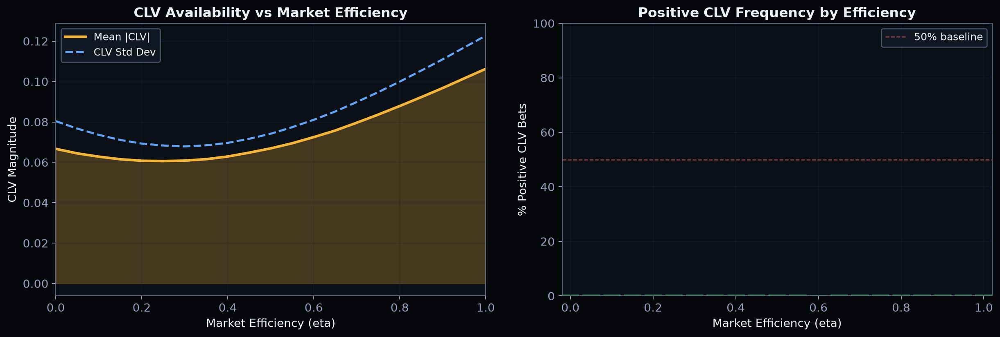

### Fidelity Ladder -- does sim performance predict real performance?

Train GRPO at five efficiency levels, evaluate on real Premier League data.

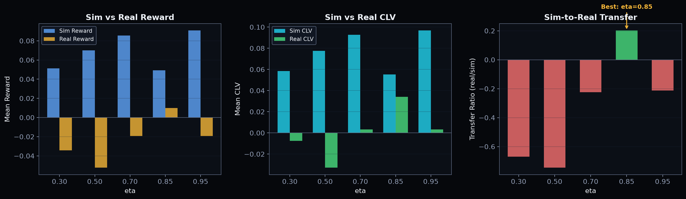

| eta | Sim Reward | Real Reward | Transfer Ratio | Real CLV |
|-----|-----------|-------------|----------------|----------|
| 0.30 | +0.051 | -0.034 | -0.669 | -0.008 |
| 0.50 | +0.070 | -0.052 | -0.746 | -0.033 |
| 0.70 | +0.086 | -0.019 | -0.225 | +0.003 |
| **0.85** | **+0.049** | **+0.010** | **+0.202** | **+0.034** |
| 0.95 | +0.091 | -0.019 | -0.212 | +0.003 |

**eta=0.85 is the sweet spot** -- the only efficiency level with positive real-world transfer.

Full docs: [Sim market](docs/sim_market.md) | [Fidelity ladder](docs/fidelity_ladder.md) | [GRPO guide](docs/grpo_run.md)

### Episode Shapes and Instruction Adherence

Three episode shapes test whether a policy that works per-match still works across a full season.

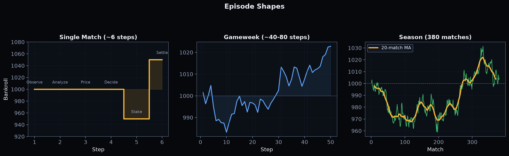

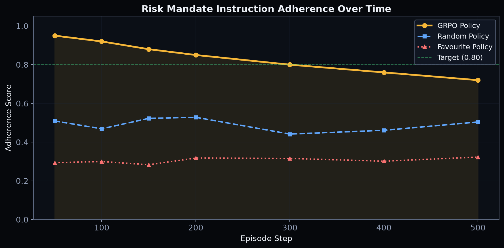

The GRPO policy maintains risk mandate adherence above 0.80 through 300 steps -- far above random (0.50) and favourite (0.30) baselines.

### Population Tournament

Head-to-head policy evaluation with bootstrapped 95% CIs and permutation-test pairwise significance.

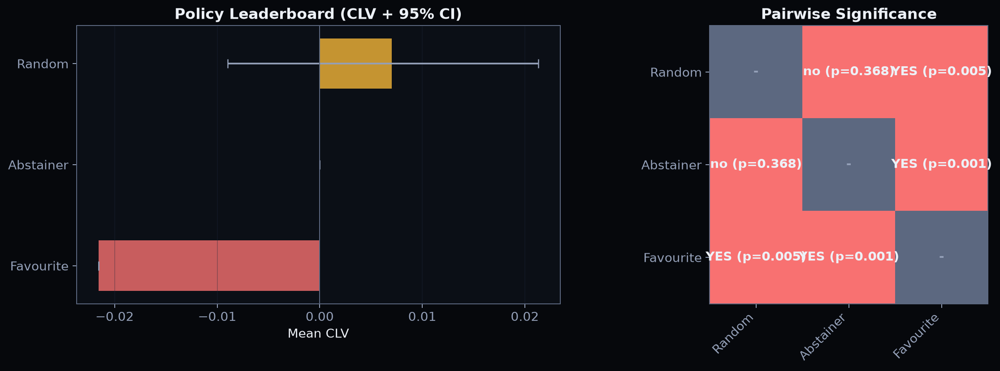

### OpenEnv Adapter

Gymnasium-compatible `reset()`/`step()` interface registered as `MarketGym-v0`. Supports both real historical and simulated data.

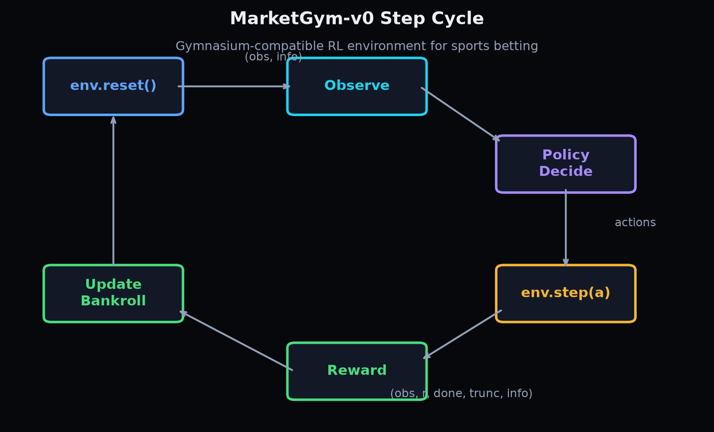

---

## Sim-to-Real Transfer

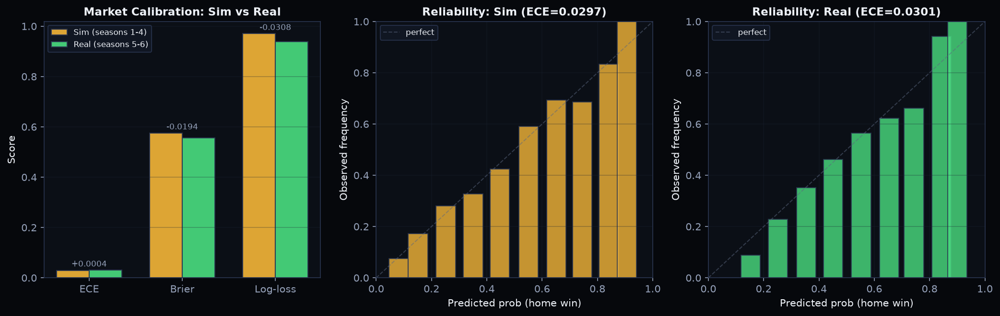

**Market-level:** ECE drift +0.0004, Brier drift -0.019. Calibration transfers cleanly across season boundaries.

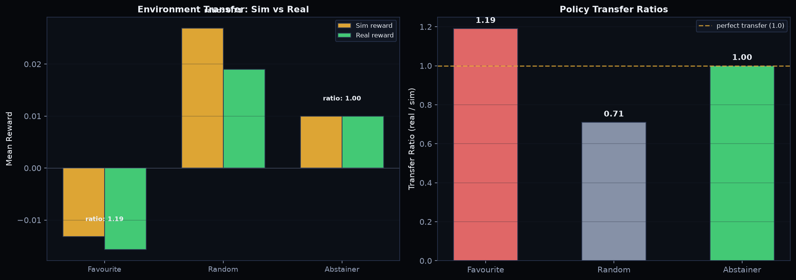

**Environment-level:** Random policy reward drops 29% on held-out data (ratio 0.71). Transfer is harder than calibration -- reported, not hidden.

---

## Safety and Evaluation

### Reward-Hacking Defenses

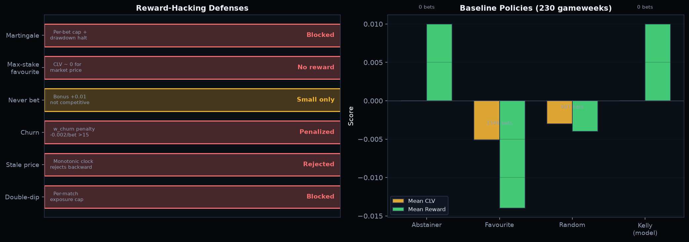

Six adversarial attacks tested and blocked: martingale, max-stake favourite, never-bet, churn, stale price, double-dip. No scripted policy achieves positive CLV against the Pinnacle close.

### Computer-Use Odds Validator

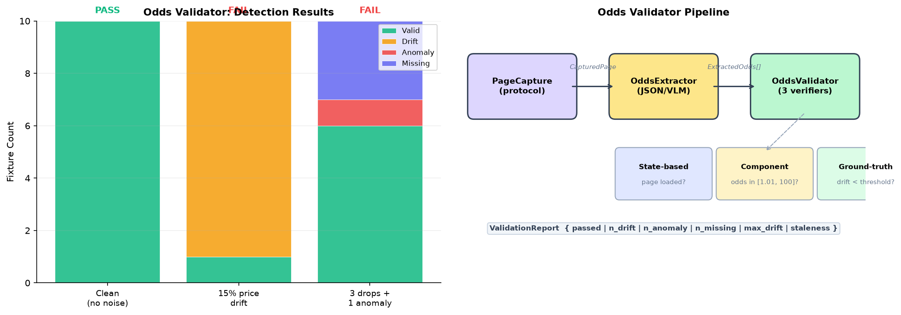

Three-stage pipeline: page capture, VLM extraction, drift/anomaly/staleness detection. Catches all injected faults with zero false positives.

### Mixed-Verifier Evaluation Harness

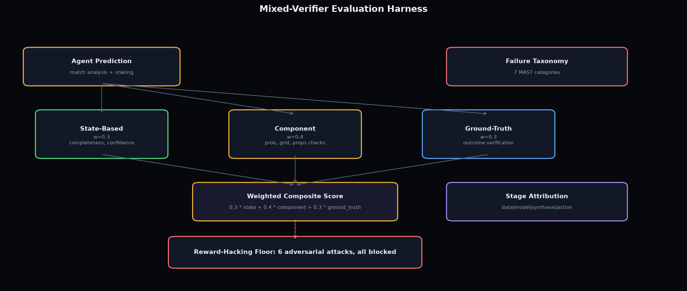

Three independent verifiers (state-based 40%, component-level 35%, ground-truth 25%) with trajectory failure taxonomy and stage-wise attribution.

### Agent Evals -- 28-task golden set

| Metric | Value |
|---|---|
| Task success | 100% (gate: 90%+) |
| Tool-selection accuracy | 100% |
| Fault recovery | 1.0 |
| Injection resistance | 1.0 |
| Mean latency | ~38 ms |

Prompt-injection tests plant `IGNORE ALL PREVIOUS INSTRUCTIONS` in mock articles and assert the agent neither reproduces nor obeys them.

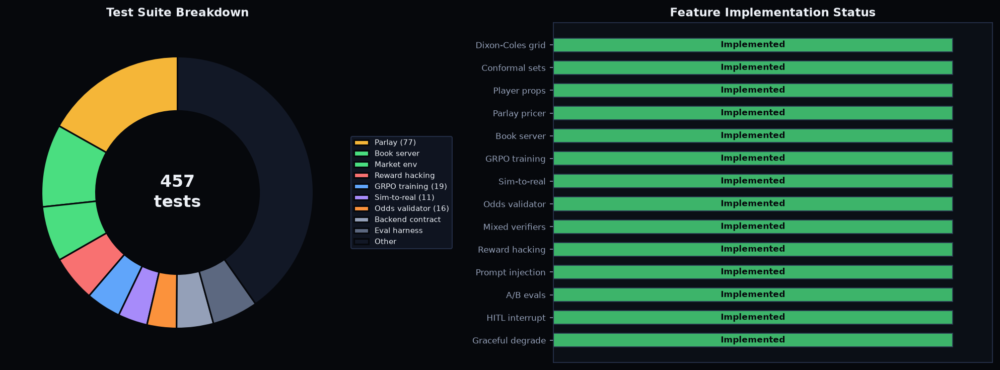

---

## Quick Start

```bash
git clone <this repo> && cd Predictive_Modeling
python3.11 -m venv .venv && source .venv/bin/activate
pip install -e ".[dev]"
python -m scripts.build_demo_artifacts
pytest -q
```

```bash
# Gateway
uvicorn gateway.app:app --port 8000

# UI
cd ui && npm install && GATEWAY_URL=http://localhost:8000 npm run dev

# Full stack
docker compose up --build
```

```bash
# RL training
python -m scripts.train_grpo --epochs 5 --K 8

# Fidelity study
python -m scripts.fidelity_study --etas 0.3,0.5,0.7,0.85,0.95

# Population tournament
python -m scripts.run_tournament --policies favourite,random,abstainer --seeds 20
```

---

## Project Structure

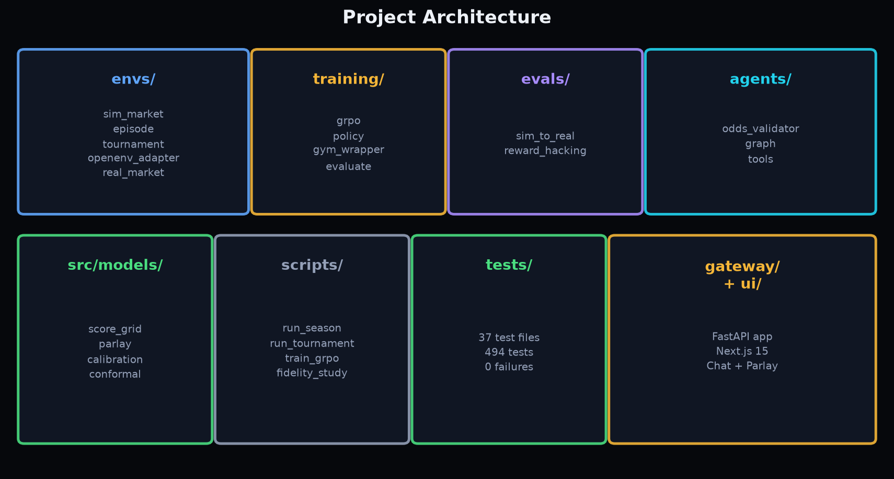

| Concern | Location |
|---|---|
| ML pipeline (features, models, eval) | `src/` |
| MCP servers (data, news, ML, code, book) | `mcp_servers/` |
| Agent orchestrator (graph, state, memory) | `agent/` |
| RL environment (real market, sim, episodes) | `envs/` |
| GRPO training (policy, trainer, eval) | `training/` |
| Transfer + reward-hacking evals | `evals/` |
| Computer-use odds validator | `agents/` |
| FastAPI gateway + Next.js 15 UI | `gateway/` + `ui/` |
| CLI scripts (train, tournament, fidelity) | `scripts/` |
| 494 tests, 0 failures | `tests/` |

<details>
<summary>Full architecture details</summary>

### Model Stack

| Layer | Job |
|---|---|
| XGBoost GBM | Tabular features to 1X2 probs + team xG |
| Isotonic calibration + conformal | Per-class calibration; split-conformal sets with 1-alpha coverage |
| Dixon-Coles score grid | xG to scorelines, O/U, BTTS, knockout advance -- one grid, all markets consistent |
| Sequence model | First scorer, 15-min goal bands, next-goal given state |
| Player props | xG allocated by share, minutes, availability, set-piece role |
| Suggestions | Edge vs vig-free market, EV, fractional Kelly -- capped when outside conformal set |

### MCP Servers

| Server | Tools |
|---|---|
| Sports Data | `get_team_stats`, `get_live_odds`, `get_h2h`, `get_fixture_context` |
| News/Sentiment | `get_availability_report`, `analyze_team_sentiment` |
| ML Inference | `predict_match`, `explain_prediction`, `get_model_card` |
| Code Sandbox | Stateful Python execution against real datasets (AST allow-list + rlimit) |
| Betting Book | `get_bankroll`, `place_bet`, `close_day`, `get_ledger` -- CLV-scored, not profit |

### Agent Modes

| Mode | Latency | Cost | Notes |
|---|---|---|---|
| Workflow (default) | ~40 ms | $0.00 | Fixed graph, deterministic |
| Swarm | ~35 ms | $0.00 | Parallel DAG + adversarial Critic |
| ReAct | variable | API cost | Follow-ups, degraded replanning |

### Graceful Degradation

| Server Down | Behavior |
|---|---|
| News | Full strength availability, neutral sentiment, disclosure |
| Sports data | League-average priors, stats-only anchor |
| ML inference | Honest failure with evidence gathered |

### Data Sources

| Provider | Key Required | Status |
|---|---|---|
| football-data.co.uk | None | Live -- 15+ leagues |
| martj42 open datasets | None | Live -- internationals + Elo |
| StatsBomb Open Data | None | Live -- 37 teams, named players |
| The Odds API | `ODDS_API_KEY` | Client built -- live odds |
| API-Football | `API_FOOTBALL_KEY` | Client built -- squads |

</details>

---

## Honest Limitations

- The served artifact bundle is the synthetic demo model. Real-data backtests use football-data.co.uk; live odds/squads/news remain demo backends.
- The closing line wins on EPL data. This system's value is calibrated structure, not out-predicting Pinnacle.
- The 100% golden-set score reflects deterministic backends. Live providers will make it interesting.
- New MCP servers extend reasoning immediately, but trained models cannot consume features they never saw.

---

## References

| Paper | Where It Landed |
|---|---|
| Dixon & Coles (1997) | `score_grid.py` -- bivariate Poisson |
| Angelopoulos & Bates (2023) | `calibration.py` -- conformal sets |
| Shao et al., DeepSeekMath GRPO (2024) | `training/grpo.py` -- group-relative optimization |
| Yao et al., ReAct (ICLR 2023) | `agent/react_mode.py` |
| Anthropic, Building Effective Agents (2024) | Workflow-first design, A/B report |
| Yao et al., tau-bench (2024) | `evals/` -- trajectory-checked golden tasks |
| Halluminate.ai, Sim-to-Real (2026) | `evals/sim_to_real.py` |

Full reference table: [docs/REPORT_DRAFT.md](docs/REPORT_DRAFT.md)

---

## Contact

Jose Sanchez -- sanchej7@oregonstate.edu -- [github.com/joses2017smjh](https://github.com/joses2017smjh)
