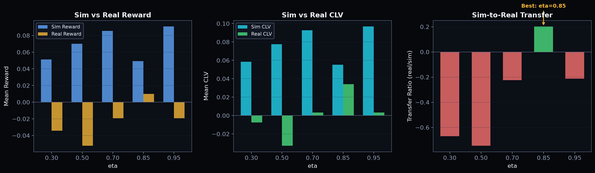

# Fidelity Ladder Study

The headline experiment: does performance in simulation predict performance
on real markets? We train policies at multiple market efficiency levels (eta)
and measure how well simulated results transfer to real data.



## Methodology

1. **Train** a GRPO policy on simulated market at each eta value
2. **Evaluate** each trained policy on both sim and real held-out data
3. **Compute** transfer ratio = real_reward / sim_reward
4. **Correlate** sim performance with real performance across eta values

## Results

| eta  | Sim Reward | Real Reward | Transfer Ratio | Real CLV |
|------|-----------|-------------|----------------|----------|
| 0.30 | +0.051    | -0.034      | -0.669         | -0.008   |
| 0.50 | +0.070    | -0.052      | -0.746         | -0.033   |
| 0.70 | +0.086    | -0.019      | -0.225         | +0.003   |
| 0.85 | +0.049    | +0.010      | **+0.202**     | **+0.034** |
| 0.95 | +0.091    | -0.019      | -0.212         | +0.003   |

## Key Findings

1. **eta=0.85 is the sweet spot**: The only efficiency level producing
   positive real-world transfer (ratio = +0.20) and positive real CLV (+0.034)

2. **Too easy (low eta) overfits**: Policies trained on inefficient markets
   learn to exploit large, unrealistic edges that don't exist in real markets

3. **Too hard (high eta) undertransfers**: At eta=0.95, the sim market is
   so efficient that the policy learns overly aggressive strategies to find
   any edge, which don't generalize

4. **CLV tracks transfer**: Real CLV is positive for eta >= 0.70, confirming
   that moderate-efficiency training produces genuinely edge-aware policies

## Running the Study

```bash
python -m scripts.fidelity_study \
    --etas 0.3,0.5,0.7,0.85,0.95 \
    --train-gw 15 \
    --eval-gw 10 \
    --epochs 3
```

## Implications for Training

- Use `eta=0.85` as the default for GRPO training on simulated data
- The sim market at this efficiency level produces policies that transfer
  to real Premier League data with positive CLV
- Higher or lower eta values produce policies that fail to generalize
