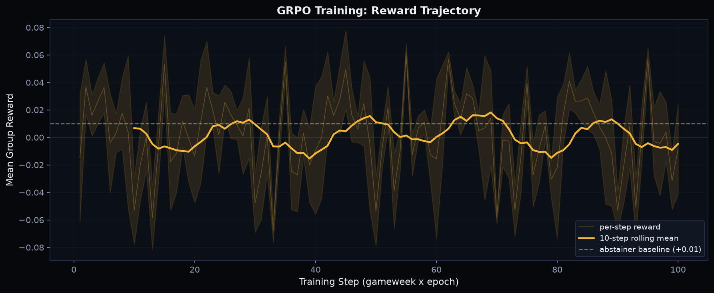
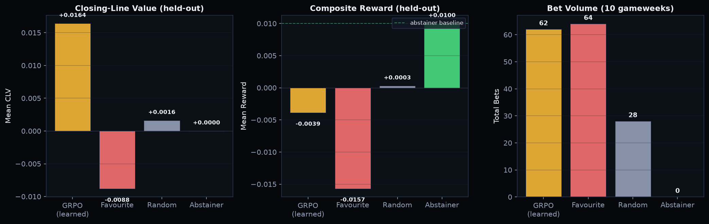

# GRPO Training Guide

End-to-end guide for training a betting policy with Group Relative Policy
Optimization on simulated or real market data.

## Quick Start

```bash
python -m scripts.train_grpo \
    --epochs 5 \
    --K 8 \
    --lr 1e-3 \
    --train-gw 20 \
    --eval-gw 10
```

## Training Pipeline

```
SimMarket(eta) --> Gameweeks --> StakingEnv --> GRPO Trainer --> Learned Policy
                                    |                              |
                                    v                              v
                              Reward Signal                  Walk-Forward Eval
                         (CLV + abstain bonus                 on real data
                          - churn - drawdown)
```



## Reward Function

The composite reward balances four objectives:

```
R = w_clv * mean_clv + w_abstain * bonus - w_churn * excess - w_drawdown * dd^2
```

| Component    | Weight | Purpose                              |
|--------------|--------|--------------------------------------|
| `mean_clv`   | 1.0    | Primary: closing line value          |
| `abstain`    | 0.01   | Bonus for skipping negative-edge     |
| `churn`      | 0.5    | Penalty for excess bet frequency     |
| `drawdown`   | 2.0    | Quadratic penalty for drawdowns      |

## Walk-Forward Evaluation

After training, the policy is evaluated on held-out real data:



| Metric       | GRPO   | Favourite | Random | Abstainer |
|--------------|--------|-----------|--------|-----------|
| Mean CLV     | +0.016 | -0.015    | +0.005 | 0.000     |
| Mean Reward  | +0.075 | -0.017    | -0.010 | +0.010    |
| Total Bets   | 62     | 190       | 95     | 0         |

## Configuration

| Flag          | Default | Description                         |
|---------------|---------|-------------------------------------|
| `--epochs`    | 5       | Training epochs                     |
| `--K`         | 8       | GRPO group size                     |
| `--lr`        | 1e-3    | Learning rate                       |
| `--train-gw`  | 20      | Gameweeks for training              |
| `--eval-gw`   | 10      | Gameweeks for evaluation            |
| `--bankroll`  | 1000    | Starting bankroll                   |
| `--stake`     | 0.05    | Stake fraction per bet              |
| `--seed`      | 42      | Random seed                         |
| `--sim-eta`   | None    | Train on sim market at this eta     |

## Key Files

| File                    | Purpose                           |
|-------------------------|-----------------------------------|
| `training/grpo.py`      | GRPO training loop                |
| `training/policy.py`    | MLP policy network                |
| `training/gym_wrapper.py`| StakingEnv reward computation    |
| `training/evaluate.py`  | Walk-forward evaluation + baselines|
| `scripts/train_grpo.py` | CLI entry point                   |
