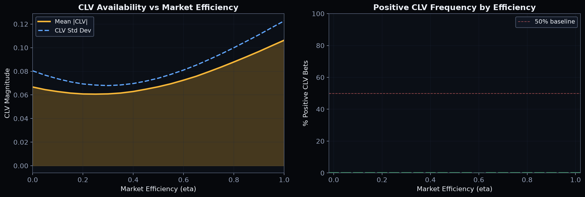

# Simulated Market Generator

Tunable-efficiency synthetic market for training and evaluating betting policies
without needing real bookmaker data.

## The eta Parameter

The market efficiency parameter `eta` in [0, 1] controls how far the closing
line moves toward the true probability:

| eta   | Closing Line Behavior           | CLV Profile                |
|-------|---------------------------------|----------------------------|
| 0.00  | Random walk from opening        | Low |CLV|, noisy            |
| 0.50  | Halfway blend of truth + noise  | Moderate |CLV|             |
| 0.85  | Near-efficient (realistic)      | Realistic edge distribution|
| 1.00  | Closing = true probability      | Highest |CLV|, informative |



## Architecture

```
true_probs ~ Dirichlet(alpha)
    |
    +---> opening_odds = true_probs + noise + margin + FLB
    |
    +---> closing_odds = eta * true_probs + (1-eta) * random_walk(opening)
    |
    +---> outcome ~ Categorical(true_probs)
```

## Key Functions

| Function                  | Purpose                                      |
|---------------------------|----------------------------------------------|
| `generate_season()`       | Full season with gameweeks and true probs     |
| `generate_fixture_batch()`| N standalone fixtures for quick testing       |
| `sim_clv_distribution()`  | CLV statistics for a given eta                |
| `calibrate_eta()`         | Find eta matching target mean |CLV|           |

## Usage

```python
from envs.sim_market import MarketConfig, generate_season

config = MarketConfig(eta=0.85, seed=42, n_matches_per_gw=10)
season = generate_season(config=config, n_gameweeks=38)

for gw in season.gameweeks:
    for fix in gw.fixtures:
        print(f"{fix.home} vs {fix.away}: {fix.odds_h}/{fix.odds_d}/{fix.odds_a}")
```

## Favourite-Longshot Bias

The `flb_strength` parameter compresses probabilities toward equal, simulating
the real-world favourite-longshot bias where longshots are overbet and
favourites are underbet:

```python
config = MarketConfig(eta=0.85, flb_strength=0.3, seed=42)
```

## Configuration

All parameters on `MarketConfig`:

| Parameter         | Default | Description                           |
|-------------------|---------|---------------------------------------|
| `eta`             | 0.85    | Market efficiency [0, 1]              |
| `margin`          | 0.05    | Bookmaker overround                   |
| `flb_strength`    | 0.15    | Favourite-longshot bias strength      |
| `n_matches_per_gw`| 10     | Fixtures per gameweek                 |
| `opening_noise_std`| 0.08  | Noise on opening line                 |
| `movement_std`    | 0.03    | Random walk step size for closing     |
| `seed`            | None    | RNG seed for reproducibility          |
