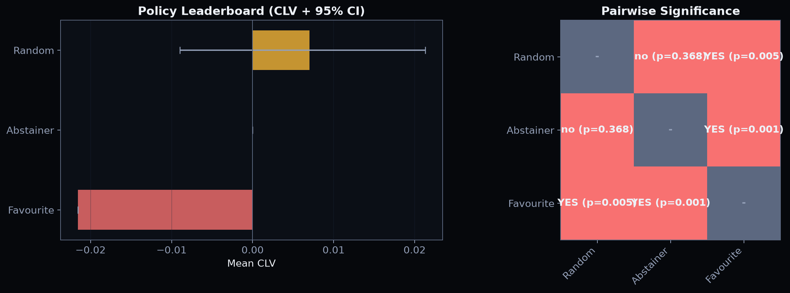

# Population Tournament

Evaluate multiple betting policies head-to-head on identical market data with
bootstrapped confidence intervals and permutation-test significance.



## How It Works

1. **Identical seeds**: Every policy sees the same gameweek sequence per seed
2. **Multiple seeds**: Each policy is evaluated `n_seeds` times for variance
3. **Bootstrap CIs**: 95% percentile bootstrap on per-run mean CLV and reward
4. **Pairwise significance**: Permutation test (10k permutations) on CLV distributions

## Usage

```python
from envs.tournament import run_tournament
from training.evaluate import FavouritePolicy, RandomPolicy, AbstainerPolicy

policies = [
    ("GRPO", learned_policy),
    ("Favourite", FavouritePolicy()),
    ("Random", RandomPolicy(seed=42)),
    ("Abstainer", AbstainerPolicy()),
]

report = run_tournament(policies, gameweeks, n_seeds=20, n_bootstrap=2000)

# Leaderboard sorted by mean CLV
for row in report.leaderboard_table():
    print(f"{row['rank']}. {row['policy']}: CLV={row['mean_clv']:.4f} {row['clv_95ci']}")

# Pairwise significance matrix
matrix = report.significance_matrix()
```

## CLI

```bash
python -m scripts.run_tournament \
    --policies favourite,random,abstainer \
    --seeds 20 \
    --max-gw 10
```

## Output Format

### Leaderboard Table

| Field        | Type   | Description                     |
|--------------|--------|---------------------------------|
| `rank`       | int    | Position (1 = best)             |
| `policy`     | str    | Policy name                     |
| `mean_clv`   | float  | Mean CLV across all runs        |
| `clv_95ci`   | str    | 95% bootstrap CI                |
| `mean_reward`| float  | Mean composite reward            |
| `total_bets` | int    | Total bets placed across runs   |
| `n_runs`     | int    | Number of evaluation runs       |

### Significance Matrix

Each cell is `YES (p=X)` or `no (p=X)` indicating whether the row policy
is statistically distinguishable from the column policy at alpha=0.05.
